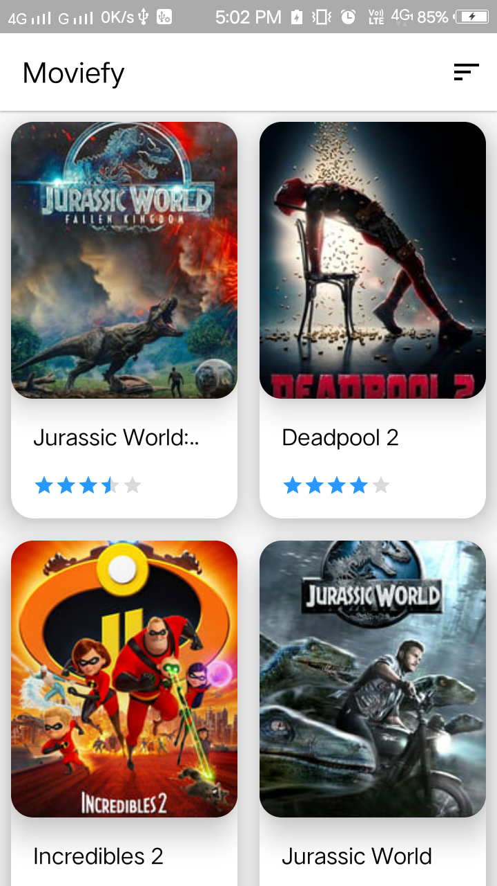
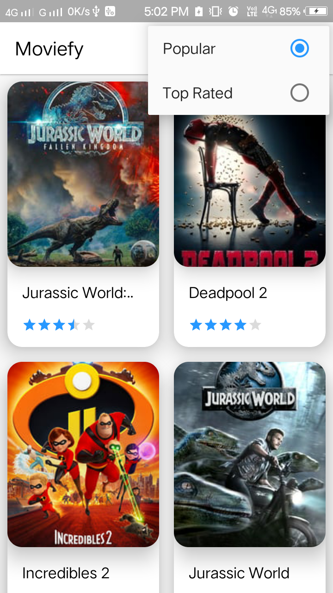
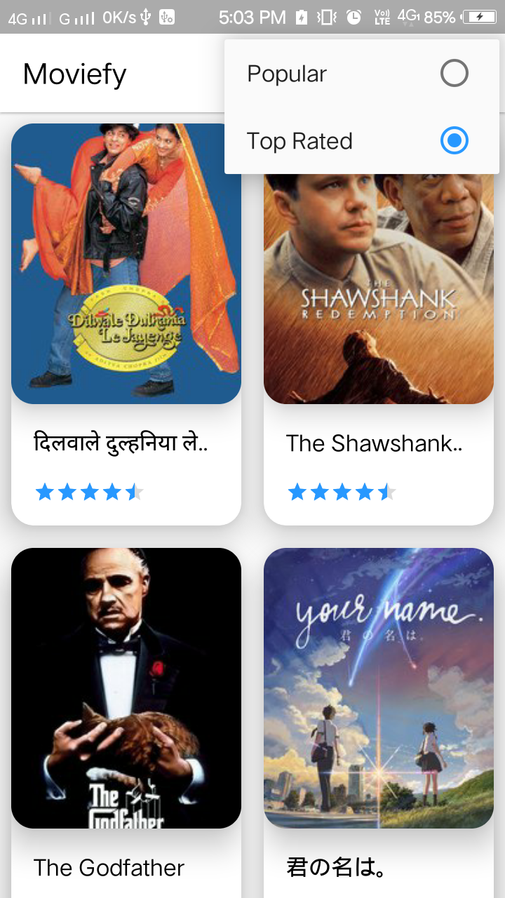
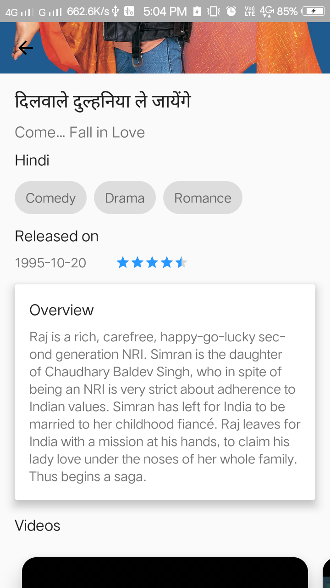
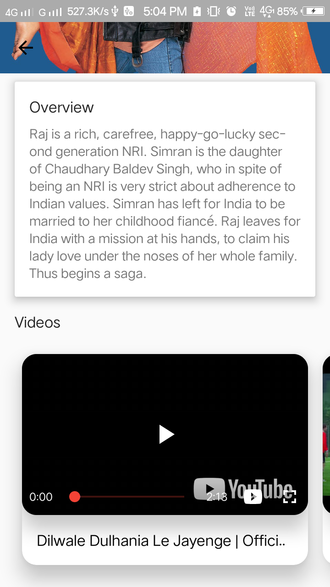

# Moviefy 🎥 

Popular Movies App is the second project in Udacity's Android Developer Nanodegree.
A simple Android app, that helps user to discover movies.

**Features:**

- Discover the most popular, the highest rated movies
- Watch movie trailers and teasers
- Material design

# Screenshot

| Splash Screen | Listing Screen |
| ------------------ | ------------------ |
|   |   |

| Popular | Top Rated |
| ------------------ | ------------------ |
|   |   |

| Detail screen | Detail screen | Youtube player |
| ------------------ | ------------------ | ------------------ |
|   |   |   |

### API Key

The app uses themoviedb.org API to get movie information and posters. You must provide your own [API key][1] in order to build the app.

Just put your API key into `value` resource folder's `strings.xml` file:

```<?xml version="1.0" encoding="utf-8"?>
<resources>
    <string name="api_key">YOUR_API_KEY</string>
</resources>
```

## Questions?🤔

Hit me on twitter [](https://twitter.com/ibhavikmakwana)
[](https://medium.com/@ibhavikmakwana)
[](https://www.linkedin.com/in/ibhavikmakwana/)

License
-------

    Copyright 2018 Bhavik Makwana

    Licensed under the Apache License, Version 2.0 (the "License");
    you may not use this file except in compliance with the License.
    You may obtain a copy of the License at

       http://www.apache.org/licenses/LICENSE-2.0

    Unless required by applicable law or agreed to in writing, software
    distributed under the License is distributed on an "AS IS" BASIS,
    WITHOUT WARRANTIES OR CONDITIONS OF ANY KIND, either express or implied.
    See the License for the specific language governing permissions and
    limitations under the License.

[1]: https://www.themoviedb.org/documentation/api

